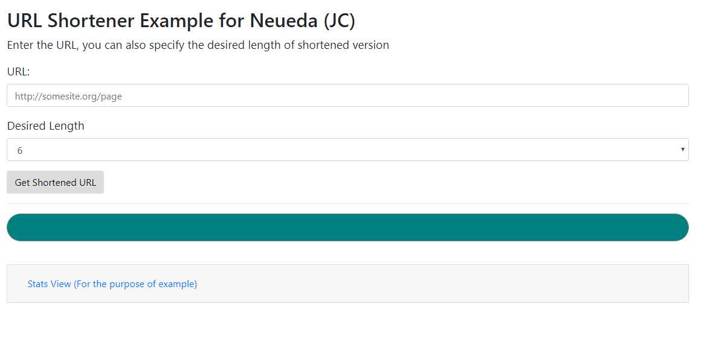
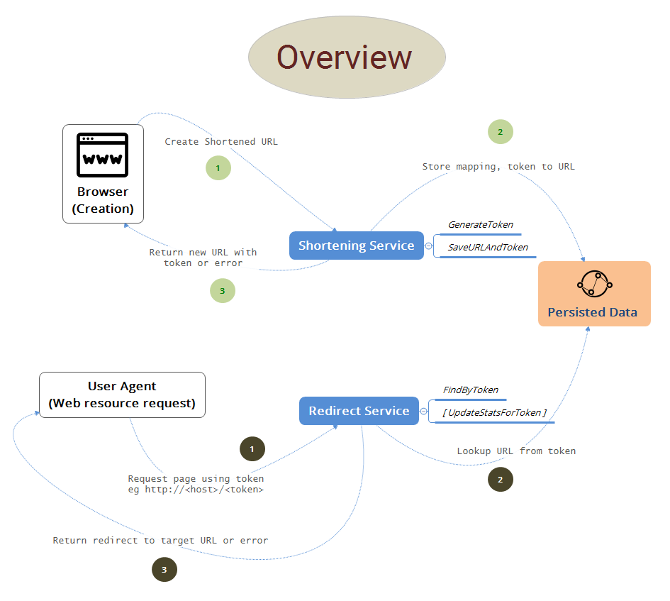
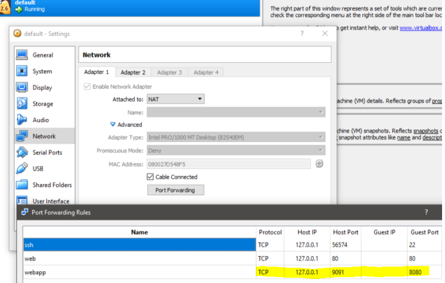
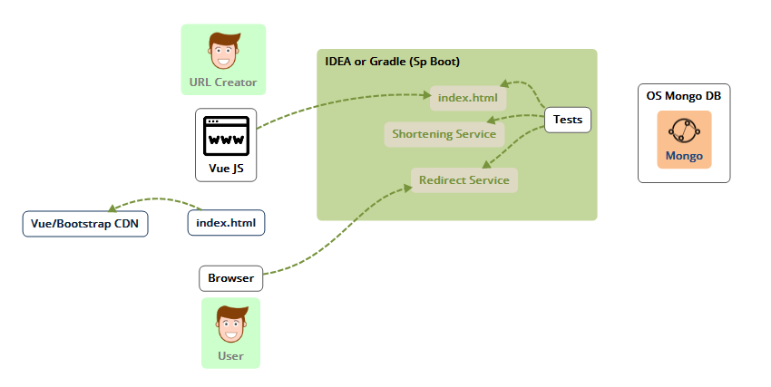
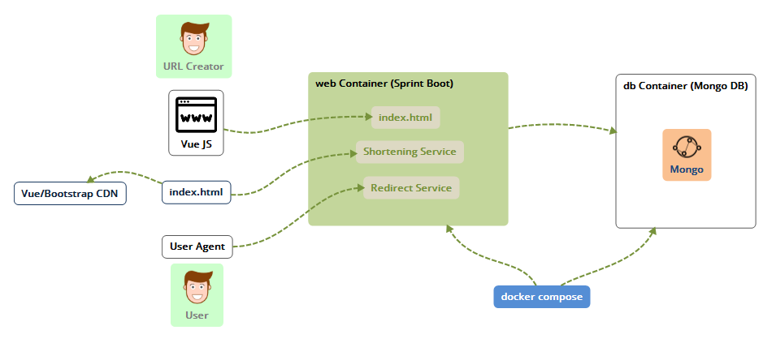

# URL Shortener Service

Exercise in creating a URL shortener service.

-----
## Quick Build Instructions

````cmd
gradlew build
cd docker
compose
````

Then test using browser on http://localhost:9091

> 

_____
<!-- TOC -->

- [URL Shortener Service](#url-shortener-service)
    - [Quick Build Instructions](#quick-build-instructions)
- [Requirements](#requirements)
    - [Additional](#additional)
    - [Non-functional requirements](#non-functional-requirements)
    - [Not in scope for initial version](#not-in-scope-for-initial-version)
- [Solution Design/Overview](#solution-designoverview)
    - [Presentation Tier (Browser)](#presentation-tier-browser)
    - [Web Tier](#web-tier)
        - [Shortening Service](#shortening-service)
        - [Redirect Service](#redirect-service)
    - [Data Tier](#data-tier)
- [Implementation Details](#implementation-details)
    - [Development Environment](#development-environment)
        - [IDEA IntelliJ](#idea-intellij)
        - [Docker](#docker)
- [Testing](#testing)
    - [Browser](#browser)
    - [Curl scripts (change port as needed)](#curl-scripts-change-port-as-needed)

<!-- /TOC -->

# Requirements

* Design and implement an API for short URL creation
* Implement forwarding of short URLs to the original ones
* There should be some form of persistent storage
* The application should be distributed as one or more Docker images

## Additional

* Design and implement an API for gathering different statistics

## Non-functional requirements

* Redirects should not cause a noticable delay to a user, ideally the redirect should arrive back as quickly as possible (depending upon network connectivity). Certainly the response time
for satisfying a redirect request should be sub 100ms

## Not in scope for initial version

* Protection against denial of service or unfair usage
* User accounts allowing non-anonymous ownership of URLs
* Should be scalable, but initial version does not have to support large scale - both in number of requests
* Administration UI and services for managing the URLs - for example removal of stale data, removal of links associated with an owner
* Complex UI to handle the shortening request, a single form should suffice - this can be extended later if needed
* CI pipeline
* Extensive tests


# Solution Design/Overview

> 

## Presentation Tier (Browser)

Single page that will accept a request (anonymous, so no need for user authentication) and forward the request asynchronously to the API. The result will then be served to the used in the UI.

## Web Tier

A Spring Boot (as it uses Java - however there are many other frameworks that could be used e.g. Micronaut) application, providing

- the shortening service API implementation
- persistence logic
- redirect requests

### Shortening Service

Simple API called with a single function to create a new shortened URL.

| Input | | |
| ----- | ------ | ---- |
| int  | version | API Version |
| String | url | must be of valid http/s form for a web resource |
| String | desiredLength | default is 6, but this can be changed from 4 to 10 |

**_Example:_**
````JSON
{
    "version": 1,
    "url": "http://github.com/", 
    "desiredLength": 10
}
````


| Output | | |
| ----- | ------ | ---- |
| int  | version | API Version |
| String | id | unique ID (not used now but could be used if extended to allow removal or overwrite function) |
| String | url | URL to shorten, allows for direct association with the request, useful if more than one request in-flight |
| String | shortUrl | a series of alphabetic characters uniquely identifying the target url that was shortened, does not include host etc. |

**_Example:_**
````JSON
{
    "version": 1,
    "id": "5b78130ee465c8312c51dcec",
    "url": "http://github.com/",
    "shortUrl": "EemHrPDpqd"
}
````


### Redirect Service


To scale the implementation the redirect service could be separate from the creation service, however this should not be necessary until large numbers of requests would need to be supported - this is not a known requirement, scalability could achieved by scaling out the web tier into multiple instances. 

I have added simple statistics gathering, and then an interface to see the latest ones (as an example). Each request increments the number of times a URL was redirected, logs the time and the source IP address.

> 

## Data Tier

Uses Mongo DB to store the data. This could also be front-ended with a cache such as Redis for extra speed on the redirect requests, however whether this is needed will be dependent upon the profile of the usage of the service. The cache would only be worthwhile if many requests for the same shortened URL were likely in a short period of time. The simplicity of the data model (and possible even with extending the service) does not necesssarily require a relational DB. If eventual consistency (within reason as this is a human usable service) becomes and issue, then maybe the data tier might be changed. 

# Implementation Details

* One Sprint Boot instance to handle both shorterning and redirect services
* One container with mongo
* Docker compose used to instantiate both containers with bridge network with `db` and `web` designations
* IDEA used for development, uses a local mongo DB instance using default settings
* No front end unit tests - inline script but should be implemented using webpack with ES6 modules and unit tests.
* Integration testing in place for Sprint Boot to test the shortening and redirect E2E

## Development Environment

* Developed on windows using Docker toolbox with Oracle Virtualbox.
* Default VM on Virtualbox needs to have host port 9091 mapped to 8080 (which is exposed from the web container)

> 


### IDEA IntelliJ

> 

| Notable Gradle Tasks | |
| ---- | ---- |
| bootJar|  Builds, tests and creates an uber jar for the Spring application |

### Docker

> 

| Notable Docker Scripts | |
| ---- | ---- |
| docker/build.cmd | Manual builder for web container |
| docker/compose.cmd | Run up docker compose using docker-compose.yml. Set to uses standard mongo instance, but the web instance will refer to mongo using the `db` node name |

# Testing
## Browser

* Using Docker

http://localhost:9091/

* IntelliJ

Start mongo instance manually unless testing (embedded mongo will be used).

http://localhost:8080/


## Curl scripts (change port as needed)

 - create a shortened URL (Windows)
 ````cmd
curl -X POST http://localhost:9091/shorten -H "Content-Type: application/json" -H "Accept: application/json" -d "{ """version""": 1, """url""":"""http://github.com""" }"
````
 - Example request
````cmd
curl http://localhost:9091/nPCaQse 

````

## Automated Testing

Uses embedded mongo, just run 
````cmd
gradlew test
````
